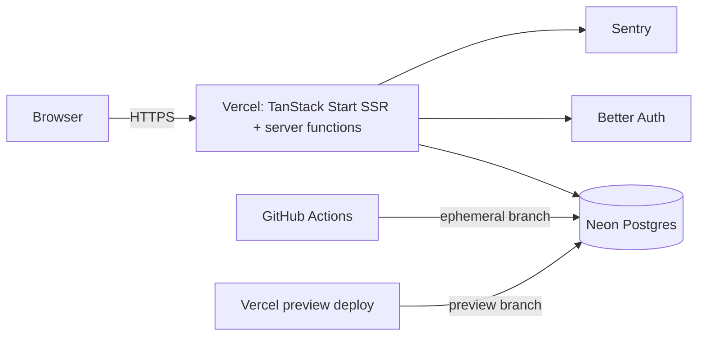

# Todo List

Full-stack task board on TanStack Start - Trello-like boards, lists and cards. [Live demo](https://todo-semenidov.vercel.app)

[](https://github.com/semenidov/tanstack-todo/actions/workflows/ci.yml)


<!-- screenshots: light / dark - to be added -->

## Stack

- [TanStack Start](https://tanstack.com/start) - SSR, server functions
- [TanStack Router](https://tanstack.com/router) + [TanStack Query](https://tanstack.com/query)
- React 19
- [Better Auth](https://www.better-auth.com/)
- [Drizzle ORM](https://orm.drizzle.team/) + Neon Postgres
- Tailwind CSS v4 + shadcn/ui
- Vitest + Playwright
- Sentry, Vercel Analytics

## Engineering highlights

- CI runs against an ephemeral Neon branch per run, not a shared test DB - [decision #26](DECISIONS.md#26-2026-09-19--ci-integration---эфемерная-neon-ветка-на-прогон-уточняет-25)
- Migrations run on ephemeral CI branches before tests, on preview via `vercel-build`, and on `master` in CI - [decision #45](DECISIONS.md#45-2026-09-28--миграции-на-эфемерных-ci-ветках-перед-тестами-30), [decision #47](DECISIONS.md#47-2026-09-25--миграции-на-preview-деплоях-через-vercel-build-уточняет-37)
- Previews share one Neon `staging` branch, migrated by `vercel-build` before the build - [decision #55](DECISIONS.md#55-2026-10-02--общая-neon-ветка-staging-для-всех-превью-отменяет-37-43-уточняет-47)
- Ownership is checked on every request via a join, not a separate query, with integration tests covering IDOR - [decision #10](DECISIONS.md#10-2026-09-18--скоуп-todos-по-userid-во-всех-server-fns-idor), [decision #48](DECISIONS.md#48-2026-09-28--доска-по-умолчанию---лениво-первая-по-createdat-доступ-через-join-в-каждом-запросе-34)
- Optimistic updates with a deferred-commit delete + Undo toast, instead of instant hard delete - [decision #5](DECISIONS.md#5-2026-09-18--удаление---стратегия-a-отложенный-коммит--undo-тост)
- Sentry wired with source maps via the Vite plugin, plus Vercel Analytics with normalized URLs - [decision #35](DECISIONS.md#35-2026-09-25--source-maps-в-sentry-через-vite-плагин-фаза-2), [decision #38](DECISIONS.md#38-2026-09-25--vercel-web-analytics--speed-insights)
- E2E coverage on Playwright for auth, route guards and data isolation, run as its own CI job - [decision #28](DECISIONS.md#28-2026-09-23--e2e-на-playwright-p0-authгварды изоляция), [decision #31](DECISIONS.md#31-2026-09-23--e2e-джоба-в-ci-эфемерная-ветка--браузер)
- Agent-assisted workflow: issue with a plan written by a stronger model, executed by an implementer subagent, then reviewed - [decision #42](DECISIONS.md#42-2026-09-25--план-на-сильной-модели-исполнение---субагент-на-sonnet), [`CODING.md`](CODING.md)

## Architecture



## Getting started

```bash
npm ci
npm run db:migrate
npm run dev
```

Requires a `.env` with `DATABASE_URL`, `DATABASE_URL_UNPOOLED` (Neon connection strings) and `BETTER_AUTH_SECRET`.

Tests:

```bash
npm run test:unit
npm run test:integration
npm run test:e2e
```

## Docs

- [DOCUMENTATION.md](DOCUMENTATION.md) - project map
- [DECISIONS.md](DECISIONS.md) - decision log (ADR)
- [CONTRIBUTING.md](CONTRIBUTING.md) - GitHub workflow
- [CODING.md](CODING.md) - code review lessons
